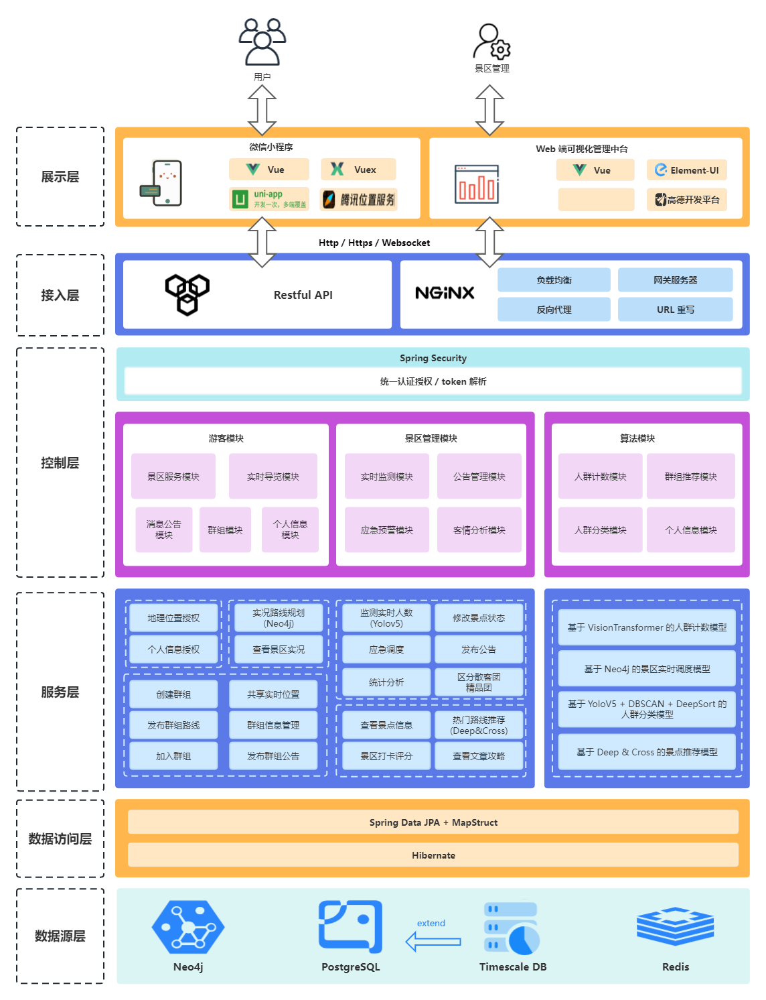
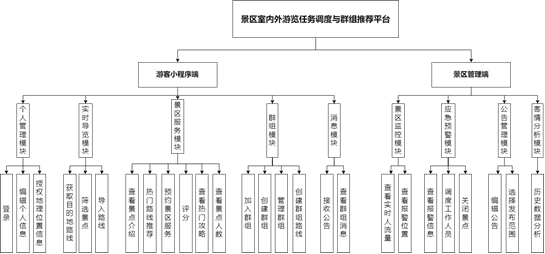

# smart-scenic-spot

智慧景区

本项目为智慧景区 smart-scenic-spot 后端部分

[gitHub 地址](https://github.com/sesuii/smart-scenic-spot.git)


|      📘       |      🛫       |      🔨       |      🏛       |
|:-------------:|:-------------:|:-------------:|:-------------:|
| [项目介绍](#项目介绍) | [项目预览](#项目预览) | [项目部署](#项目部署) | [系统架构](#系统架构) |


|       ❓         |      📑       |    👋     |           📨            |
|:---------------:|:-------------:|:---------:|:-----------------------:|
| [Q&A](#Q-and-A) | [功能描述](#功能描述) | [贡献](#贡献) | [ContactMe](#ContactMe) |

项目介绍
========

本项目基于 spring boot, spring data jpa, spring sercurity 开发实现。


🌌系统架构
========
系统总架构图如下所示




预览
====

本项目已部署在 https://expiredcanned.love

[API 在线接口文档](https://www.apifox.cn/apidoc/shared-d5982032-33e5-446a-916e-9e29f8a60bb9)

项目部署
==========

### 环境要求

✨Java Version: JDK 11

✨PostgreSQL: 14.0 及以上（并配置 Timescale DB 插件）

✨Neo4j: 4.2.x（安装 APOC-4.2.0.9 以及 GDS-1.8.7）

✨Redis: 5.0.x

### 配置修改

配置修改

修改项目根目录下**smart-scenic-spot\src\main\resources**中的**application-dev.yml**文件，即可在本地运行项目，以下是参考配置，只需将数据源的用户名和密码更换即可成功运行。

```yaml
server:
  port: 8000
spring:
  application:
    name: smart-scenic-spot
  jackson:
    time-zone: GMT+8
  redis:
    host: 127.0.0.1
    port: 6379
    password: <your_secret>
    database: 0
  data:
    redis:
      repositories:
        enabled: false
  datasource:
    jdbc-url: jdbc:postgresql://127.0.0.1:5432/smart_scenic_spot?useSSL=false&serverTimezone=Asia/Shanghai&characterEncoding=utf8
    username: <your_username>
    driverClassName: org.postgresql.Driver
    password: <your_secret>
  jpa:
    hibernate:
      ddl-auto: 'update'
      show-sql: false
    properties:
      hibernate:
        format_sql: true
  neo4j:
    uri: bolt://127.0.0.1:7687
    username: <your_username>
    password: <your_secret>
```

### 项目运行

在smart_scenic_spot项目根目录下执行命令。

```shell
mvn clean install package
```

完成构建后，在target目录下找到smart-scenic-spot-0.0.1-SNAPSHOT.jar。以下为在Linux服务器上的部署命令（后台运行）。

```shell
nohup java -jar smart-scenic-spot-0.0.1-SNAPSHOT.jar &
```

打开 nohub.out 查看服务器日志

```shell
sudo vim nohup.out
```

功能描述
========

### 总体功能结构图



贡献
====

License
=======

ContactUs
=========

|    项目成员     |         联系方式          |
|:-----------:|:---------------------:|
| [sungjah](https://github.com/sesuii) |  sjiahui27@gmail.com  |
| [ExpiredCannedX](https://github.com/ExpiredCannedX) |         null          |
| [Steve](https://github.com/Steve0ne) |         null          |
| [XXXTENTX](https://github.com/Young-Allen) |         null          |
